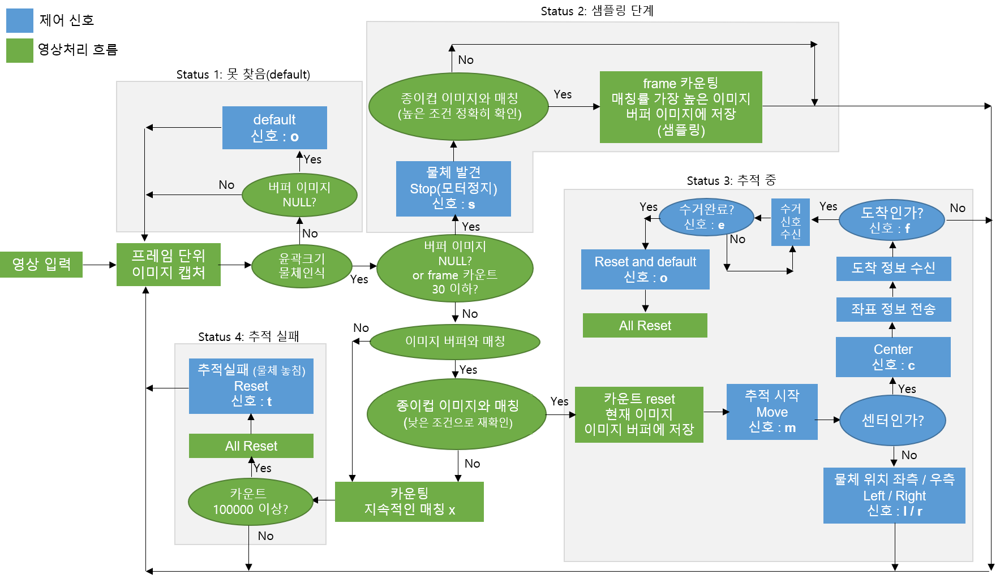

# 2019_CupDetection

## Overview
기존 가정용 로봇청소기는 종이컵과 같은 큰 쓰레기는 흡입하지 못한다. 따라서 종이컵과 같은 큰 쓰레기를 로봇팔을 이용하여 수거하는 로봇을 개발을 진행했다. 이에 필용한 종이컵 영상인식 기술을 OpenCV 를 이용하여 윤곽 검출 및 크기 분석, 종이컵 이미지 템플릿매칭 기법, 모폴로지 연산 등 전처리 과정을 포함한 종이컵 검출 기술을 구현한 프로그램이다.

__site__ : https://blog.naver.com/nuw577

---
# 영상처리 과정 및 시스템 흐름
해당 코드에는 아두이노(로봇팔, 모터)를 제외한 영상처리 및 시스템 제어 파트만 기술되어 있다.

해당 이미지는 물체(종이컵) 검출을 위한 윤곽 크기 검출 알고리즘에 관한 이미지이다.

## 시스템 흐름 알고리즘도

---
# Robot model

---

## CONCLUSION
구현된 종이컵 인식 프로그램에 더 높은 성능을 위해선 딥러닝 물체탐지(Object Dectect) 기술을 활용할 필요성이 있다. 대표적으로 Faster RCNN, YOLO 모델이 있다.